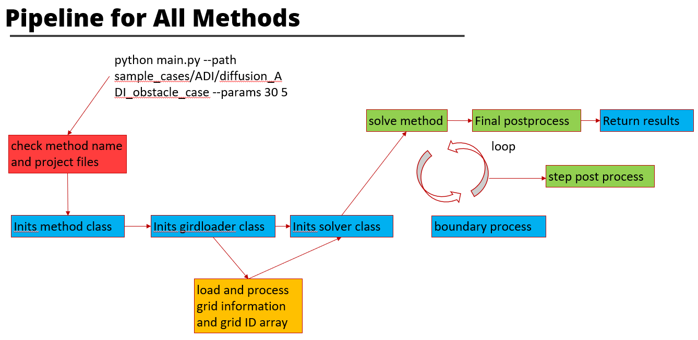
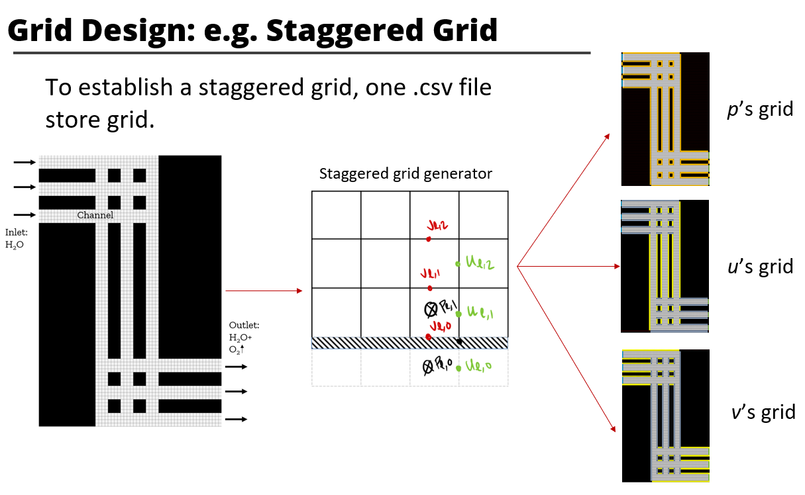
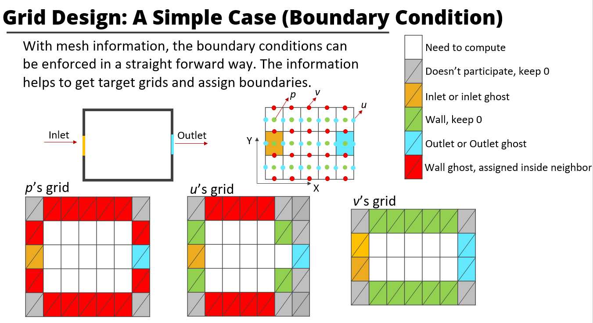
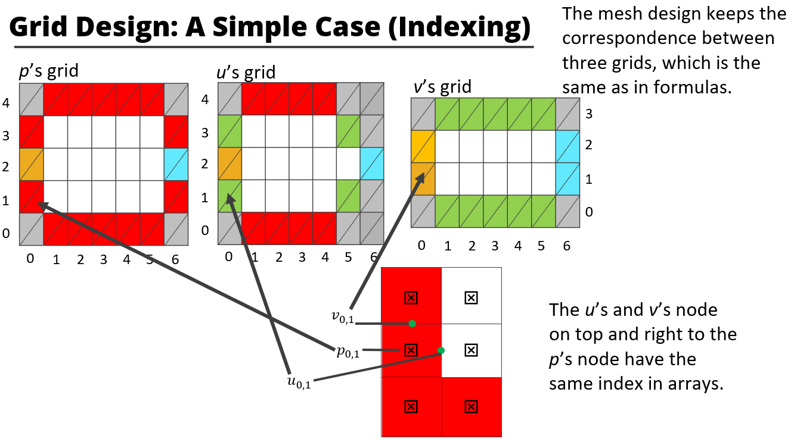
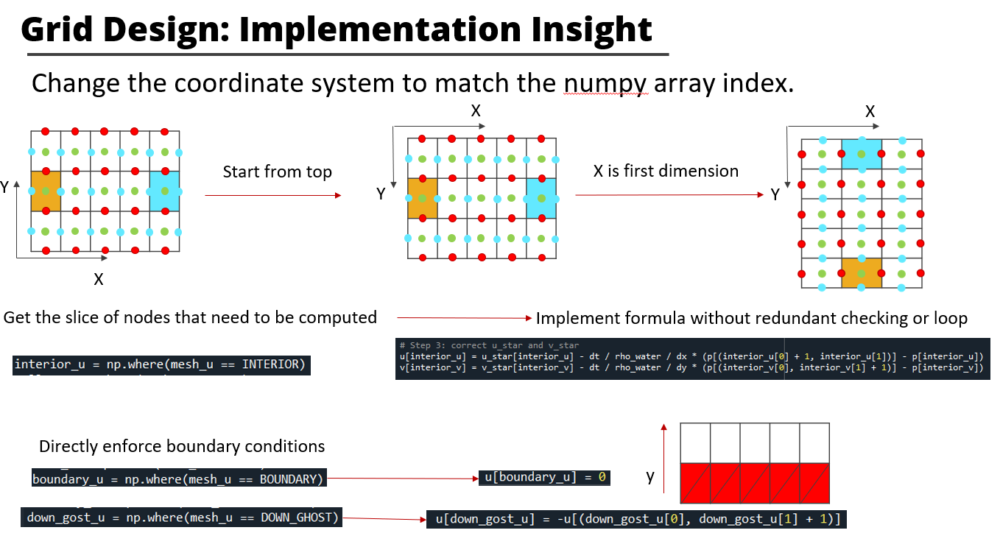

# TinyCFDSolver
A tiny python computational fluid dynamics solver with several finite difference methods by Xinyang CHEN(Thanks Wenzhuo XU's help in implementing fractional step method).  
<p align="center">
  
</p>


## Overview
The TinyCFDSolver's solvers are implemented in solvers folder. The methods (mediator classes) are implemented in methods folder. Boundary classes, plot methods and grid loaders are in utils folder. Several example cases can be found in the sample cases folder. To test the cases, the command line should follow:
```shell
# For poisson_iterative, the parameter is the right hand side of the poisson equation, which can be a float or a path.
python main.py --path sample_cases/poisson_iterative/heat_diffusion_case --params 0
# For other methods, the first parameter is the number of timesteps, and the second parameter is the check point interval. At each checkpoint, methods cache one result and also call step process funtions. 
python main.py --path sample_cases/ADI/diffusion_ADI_obstacle_case --params 30 5
# If you want to save final results as a .npy file
python main.py --path sample_cases/ADI/diffusion_ADI_obstacle_case --params 30 5 --save
```
## Requirements
```shell
pip install -r requirements.txt
```

## Demos
Fractional step method solving N-S equation:
<p align="center">
  
  
</p>

<p align="center">
  
  
</p>

Stream function vorticity method solving N-S equation:
<p align="center">
  
  
</p>

Poisson iterative solver solving heat diffusion:
<p align="center">
  
</p>

Upwind central scheme solving advection diffusion equation:
<p align="center">
  
  
</p>

Crank Nicolson implicit method solving diffusion equation:
<p align="center">
  
  
</p>

ADI method solving diffusion equation:
<p align="center">
  
  
</p>

## Project Files
Each project requires four setting files(e.g. sample_cases/upwind_central/advection_diffusion_case):  
1. gird_information.txt(Do not support comment currently)
```shell
METHOD #name of the method and parameters for it
UpwindCentral2D
PARAMETER #parameters
dx 0.01
dy 0.01
dt 0.002
u 1.5
v 1
molecular_diffusivity_x 0.001
molecular_diffusivity_y 0.001
source_temparature 1
DOMAIN #domain information, in this case only interior grid ID
mesh -1
BOUNDARY #boundaries, group gridID name type parameterlist
X 0 Wall_Neumman Linear 1 0 -1 0
X 1 Wall_Dirichlet Const 0
X 2 Heat_Source Const source_temparature
X 3 Wall_Neumman Linear 1 0 1 0
X 4 Wall_Neumman Linear 1 -1 0 0
```
2. mesh.csv
```shell
# A csv file store grid ID, the solver and boundary objects can get their position by getting slice with grid ID.
0,0,0,0,0,0, ... ,0
1,-1,-1,-1,-1, ... ,4
1,-1,-1,-1,-1, ... ,4
...
1,-1,-1,-1,-1, ... ,4
3,3,3,3,3,3,3, ... ,3
```
3. lambda_functions.py
```shell
# Define all required lambda function of methods in this file. (e.g. visualization and metrics functions)
from utils import plot_one_contourf, animate
# Debug ploter
ploter = lambda X, dx, dy, dt, t: (plot_one_contourf(X.transpose(), dx, dy, "temperature at " + str(round((t + 1) * dt, 3)) 
+ "s", "temperature[$^\circ$C]", 0.0, 1.05))        
animator = lambda X, dx, dy: (animate(X, dx, dy, "temperature", "temperature[$^\circ$C]", 0.0, 1.0))
lambda_list = [ploter, animator]
```

4. init.npy(optional), initial conditions

## Structure
These slides briefly show how this project is designed and implemented.
<p align="center">
  
</p>
<p align="center">
  
</p>
<p align="center">
  
</p>
<p align="center">
  
</p>
<p align="center">
  
</p>
